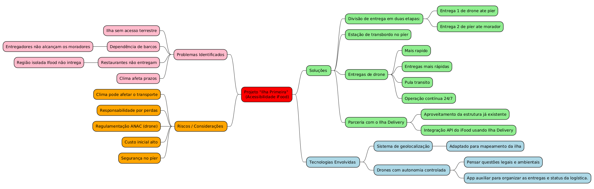

 
## Introdução
 

Mapa mental consiste em criar resumos cheios de símbolos, cores, setas e frases de efeito com o objetivo de organizar o conteúdo e facilitar associações entre as informações destacadas. Esse material é muito indicado para pessoas que têm facilidade de aprender de forma visual.

 
## Metodologia
 

Foi levantado um ponto importante sobre o app e, assim, foi produzido o mapa mental. O documento foi produzido utilizando a ferramenta PlantText UML. 

 
## Mapa mental - Geral.
 
## Versão 1.0
 
### Mapa mental Ver. 1.0

### Mapa mental Ver. 2.0

 
## Conclusão
 

O mapa mental é uma ficha de estudos que ajuda a dar uma visão geral do tema, e ajuda a fixar os pontos mais importantes sobre o app. O mapa mental também funciona como uma forma visual de visualizar o brainstorming.

 
## Referências
> Mapa Mental feito usando PlantText UML,  Disponível em: [PlantText UML](https://www.planttext.com/)

 
## Versionamento
| Data | Versão | Descrição | Autor(es) |
| -- | -- | -- | -- |
| 01/04/2025 | 1.0 | Editando do documento | Nicholas Borges |
| 01/04/2025 | 2.0 | Adicionado Mapa mental Ver 1 | Nicholas Borges |
